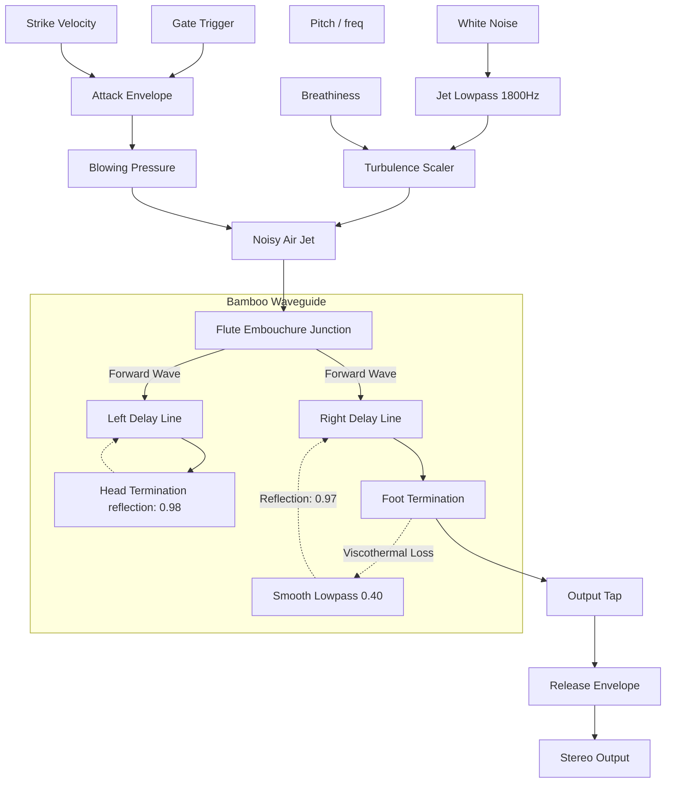

# Bansuri DSP Physical Model Architecture

The Bansuri is modeled using a bi-directional acoustic waveguide, which simulates pressure waves traveling up and down a cylindrical bamboo tube.

```mermaid
graph TD
    %% Inputs
    Gate[Gate Trigger]
    Velocity[Strike Velocity]
    Breath[Breathiness]
    Freq[Pitch / freq]
    
    %% Excitation Subsystem
    Noise[White Noise] --> LPF_Jet[Jet Lowpass 1800Hz]
    LPF_Jet --> Turb[Turbulence Scaler]
    Breath --> Turb
    
    Gate --> AttEnv[Attack Envelope]
    Velocity --> AttEnv
    
    AttEnv --> Press[Blowing Pressure]
    Turb --> MixExc[Noisy Air Jet]
    Press --> MixExc
    
    %% Waveguide Subsystem (Tube)
    MixExc --> Embouchure[Flute Embouchure Junction]
    
    subgraph Bamboo Waveguide
        Embouchure -->|Forward Wave| DelayL[Left Delay Line]
        Embouchure -->|Forward Wave| DelayR[Right Delay Line]
        
        DelayL --> TermHead[Head Termination reflection: 0.98]
        DelayR --> TermFoot[Foot Termination]
        
        TermFoot -.->|Viscothermal Loss| WallLoss[Smooth Lowpass 0.40]
        WallLoss -.->|Reflection: 0.97| DelayR
        
        TermHead -.-> DelayL
    end
    
    %% Output
    TermFoot --> OutputTap[Output Tap]
    OutputTap --> RelEnv[Release Envelope]
    RelEnv --> Out[Stereo Output]
```
