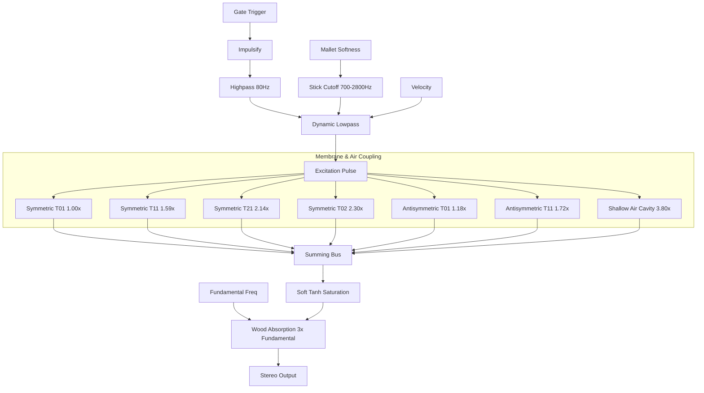

# Lagnga DSP Physical Model Architecture

The Lagnga is a tight, two-sided closed barrel drum struck with a hard wooden stick. It is modeled using modal synthesis (parallel bandpass resonators) representing the symmetric and antisymmetric coupling of the two skins.

