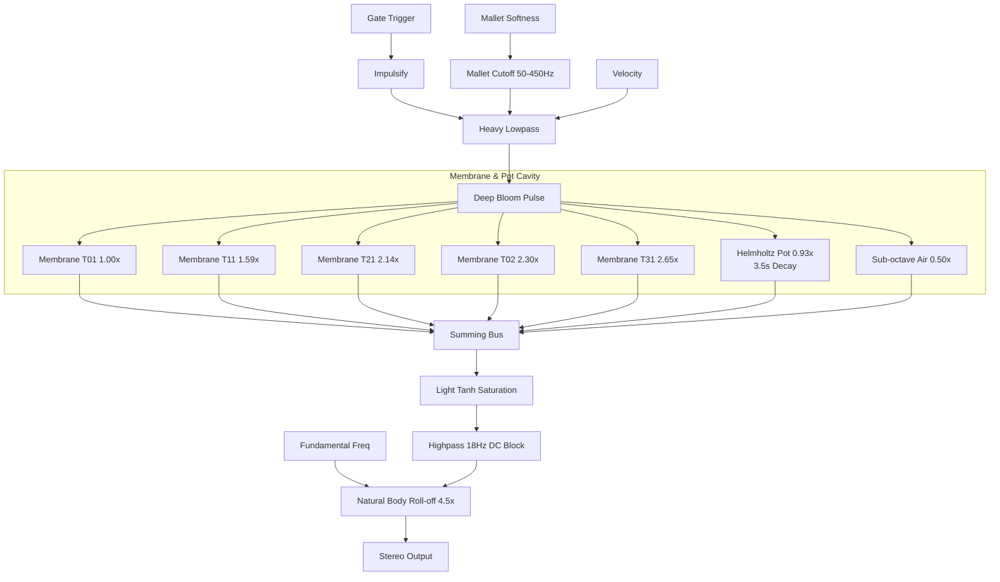

# Ngachen DSP Physical Model Architecture

The Ngachen is a large single-headed drum placed over a rigid hemispherical metal/clay pot. The defining characteristic is the Helmholtz pot resonance and the thick padded mallet.

